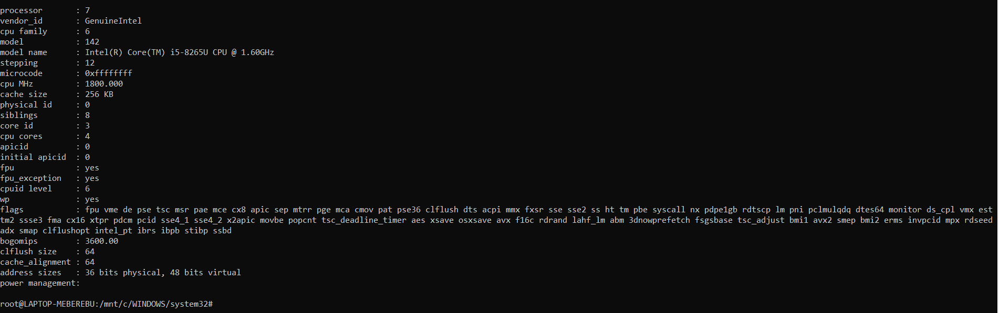
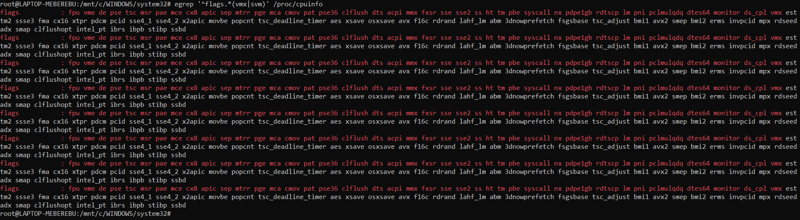
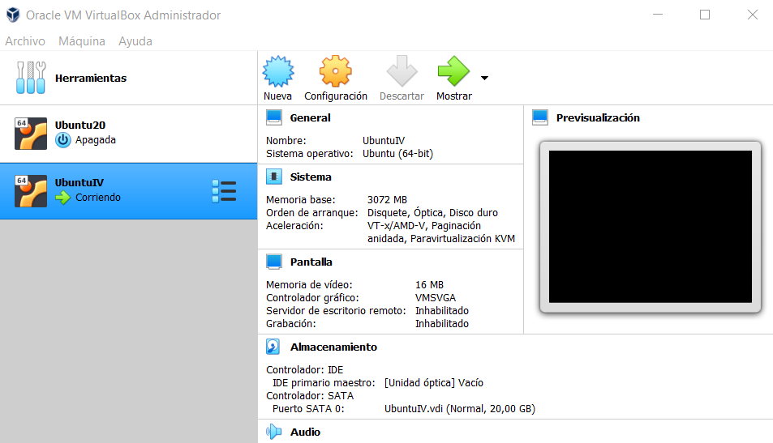

# EJERCICIOS AUTOEVALUACIÓN SEMANA 2

## Ejercicio 1

### Consultar en el catálogo de alguna tienda de informática el precio de un ordenador tipo servidor y calcular su coste de amortización a cuatro y siete años

El servidor escogido es del catalogo de la página pccomponentes y es el siguiente: [Dell PowerEdge T340](https://www.pccomponentes.com/dell-poweredge-t340-intel-xeon-e-2124-8gb-1-tb) con un precio de 815,95€

Segun la [tabla de la agencia tributaria de coeficientes de amortizacion](https://www.agenciatributaria.es/AEAT.internet/Inicio/_Segmentos_/Empresas_y_profesionales/Empresas/Impuesto_sobre_Sociedades/Periodos_impositivos_a_partir_de_1_1_2015/Base_imponible/Amortizacion/Tabla_de_coeficientes_de_amortizacion_lineal_.shtml) el porcentaje para Equipos para procesos de informacion es del 25%.

Por lo tanto el coste de amortización de dicho ordenador en un periodo de 4 años con un 25% sería de 203,9875€ anuales y para un periodo de 7 años con un 14,2857% seria de 116,517€ anuales.  

## Ejercicio 2

### Usando las tablas de precios de servicios de alojamiento en Internet “clásicos”, es decir, que ofrezcan Virtual Private Servers o servidores físicos, y de proveedores de servicios en la nube, comparar el coste durante un año de un ordenador con un procesador estándar (escogerlo de forma que sea el mismo tipo de procesador en los dos vendedores) y con el resto de las características similares (tamaño de disco duro equivalente a transferencia de disco duro) en el caso de que la infraestructura comprada se usa solo el 1% o el 10% del tiempo.

Utilizaremos por ejemplo el proveedor VPS [OVHcloud](https://www.ovh.es/order/vps/?v=3#/vps/build?selection=~(range~'Essential~pricingMode~'degressivity12~flavor~'vps-essential-2-4-80~os~'ubuntu_20_04~datacenters~(GRA~1))) que con su plan Essential nos ofrece las siguientes características:
	1.Procesador --> 2 vCore
	2.Memoria RAM --> 4GB
	3.Almacenamiento --> 80GB SSD NVMe
	4.Ancho de banda público --> 500Mb/s

Con este proveedor y este plan tenemos un compromiso de permanencia de 12 meses y nos cuesta 9,20€ al mes. Haciendo calculos nos saldría a 0,0127€ la hora.

Como proveedor de servicios en la nube he escogido por ejemplo [DigitalOcean](https://www.digitalocean.com/pricing/) que nos ofrece un plan con unas caracteristicas bastante similares como son las siguientes:
	1.Procesador --> 2 vCPUs
	2.Memoria RAM --> 4GB
	3.Almacenamiento --> 80GB 
	4.Transferencia --> 4TB

Con este proveedor y este plan nos cuesta 20€ al mes y 0,030$ la hora.

Como vemos el precio que nos supone a la hora es mas bajo el de VPS por lo tanto si solo lo vamos a utilizar un 1% o un 10% nos renta contratar el primer plan.

## Ejercicio 3

### En general, cualquier ordenador con menos de 5 o 6 años tendrá estos flags. ¿Qué modelo de procesador es? ¿Qué aparece como salida de esa orden? Si usas una máquina virtual, ¿qué resultado da? ¿Y en una Raspberry Pi o, si tienes acceso, el procesador del móvil?

Como podemos ver en la siguiente captura del archivo  el procesador que tiene mi pc es un Intel(R) Core(TM) i5-8265U CPU @ 1.60GHz

Los flags que tenemos activados en cada uno de los procesadores son los siguientes 

El resultado al ejecutar la orden en una maquina virtual es el siguiente:   

Las comprobaciones tanto en la Raspberry PI como en el movil no las puedo realizar ya que no tengo Raspberry y mi movil es un Iphone.

## Ejercicio 4

### Instalar un hipervisor para gestionar máquinas virtuales, que más adelante se podrá usar en pruebas y ejercicios. Usar siempre que sea posible un hipervisor que sea software libre.

Como hipervisor ya tengo instalado VirtualBox que además es libre y para mi uno de los mas faciles, potentes e intuitivos. A continuación adjunto una captura de pantalla:  

## Ejercicio 5

### Darse de alta en una web que permita hacer pruebas con alguno de los sistemas de gestión de nube libres como los mencionados en los párrafos anteriores, aunque sea temporalmente. Si la prueba es menos de un mes, simplemente anotarlo y dejarlo para el mes de diciembre, más o menos.

# EJERCICIOS AUTOEVALUACIÓN SEMANA 3

## Ejercicio 1

### Descargar y ejecutar las pruebas de alguno de los proyectos anteriores, y si sale todo bien, hacer un pull request a alguno de esos proyectos con tests adicionales, si es que faltan (en el momento que se lea este tema).

## Ejercicio 2

### Para la aplicación que se está haciendo, escribir una serie de aserciones y probar que efectivamente no fallan. Añadir tests para una nueva funcionalidad, probar que falla y escribir el código para que no lo haga (vamos, lo que viene siendo TDD).

## Ejercicio 3

### Crear algún conjunto de scripts de tests, usando tu lenguaje favorito, y ejecutarlos desde el marco de test más adecuado (o el que más te guste) para ese lenguaje.

## Ejercicio 4

### Instalar alguno de los entornos virtuales de node.js (o de cualquier otro lenguaje con el que se esté familiarizado) y, con ellos, instalar la última versión existente, la versión minor más actual de la 4.x y lo mismo para la 0.11 o alguna impar (de desarrollo).

## Ejercicio 5

### Como ejercicio, algo ligeramente diferente: un servicio web para calificar las empresas en las que hacen prácticas los alumnos.

### Las acciones podrían incluir

	- Crear empresa
	- Listar calificaciones para cada empresa
		- crear calificación y añadirla (comprobando que la persona no la haya añadido ya)
		- borrar calificación (si se arrepiente o te denuncia la empresa o algo)
	- Hacer un ránking de empresas por calificación, por ejemplo
	- Crear un repositorio en GitHub para la librería y crear un pequeño programa que use algunas de sus funcionalidades.

### Si se quiere hacer con cualquier otra aplicación, también es válido.

### Se trata de hacer una aplicación simple que se pueda hacer rápidamente con un generador de aplicaciones como los que incluyen diferentes microframeworks. Si cuesta mucho trabajo, simplemente prepara una aplicación que puedas usar más adelante en el resto de los ejercicios.

## Ejercicio 6

### Ejecutar el programa en diferentes versiones del lenguaje. ¿Funciona en todas ellas?

## Ejercicio 7

### Crear una descripción del módulo usando package.json. En caso de que se trate de otro lenguaje, usar el método correspondiente.

## Ejercicio 8

### Automatizar con grunt, gulp u otra herramienta de gestión de tareas en Node la generación de documentación de la librería que se cree usando docco u otro sistema similar de generación de documentación. Previamente, por supuesto, habrá que documentar tal librería.

## Ejercicio 9

### Haced los dos primeros pasos antes de pasar al tercero.

## Ejercicio 10

### Configurar integración continua para nuestra aplicación usando Travis o algún otro sitio.

# EJERCICIOS AUTOEVALUACIÓN SEMANA 4

## Ejercicio 1

### Instalar docker y/o otro gestor de contenedores como Podman/Buildah.

## Ejercicio 2

### - Instalar a partir de docker una imagen alternativa de Ubuntu y alguna adicional, por ejemplo de CentOS.
### - Buscar e instalar una imagen que incluya MongoDB.

## Ejercicio 3

### Crear un usuario propio e instalar alguna aplicación tal como nginx en el contenedor creado de esta forma, usando las órdenes propias del sistema operativo con el que se haya inicializado el contenedor.

## Ejercicio 4

### Crear a partir del contenedor anterior una imagen persistente con commit.

## Ejercicio 5

### Crear un Dockerfile para el servicio web que testee la clase que se ha venido desarrollando hasta ahora.

## Ejercicio 6

### Desplegar un contenedor en alguno de estos servicios, de prueba gratuita o gratuitos.